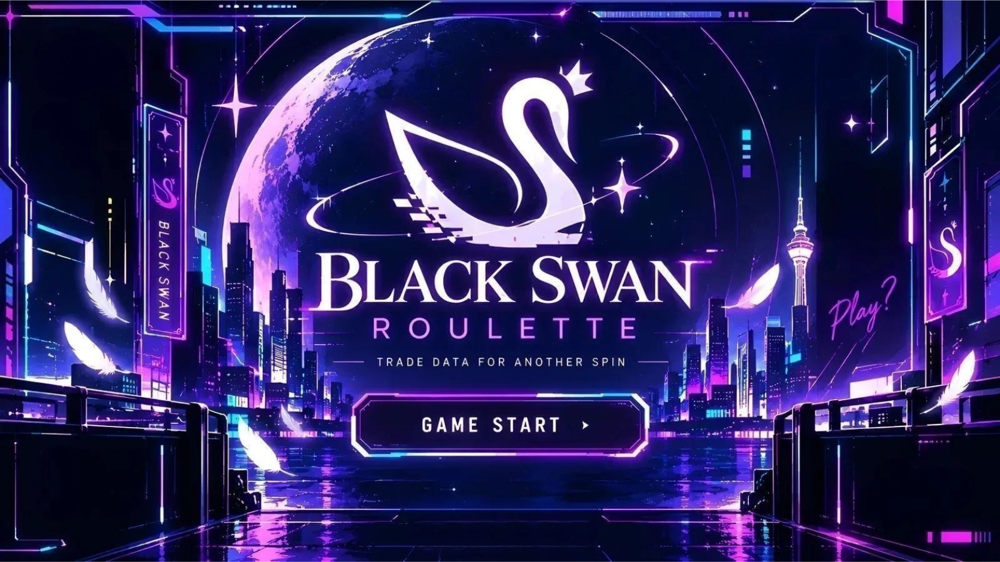
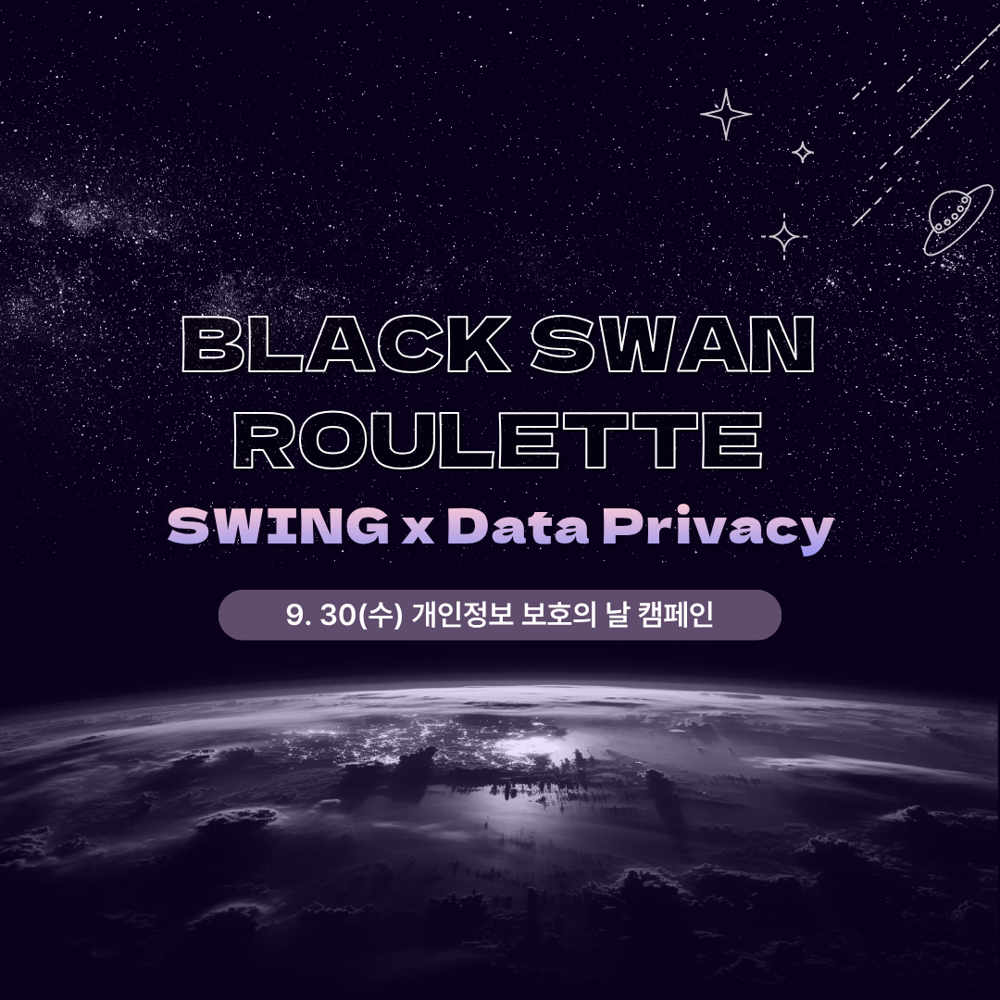
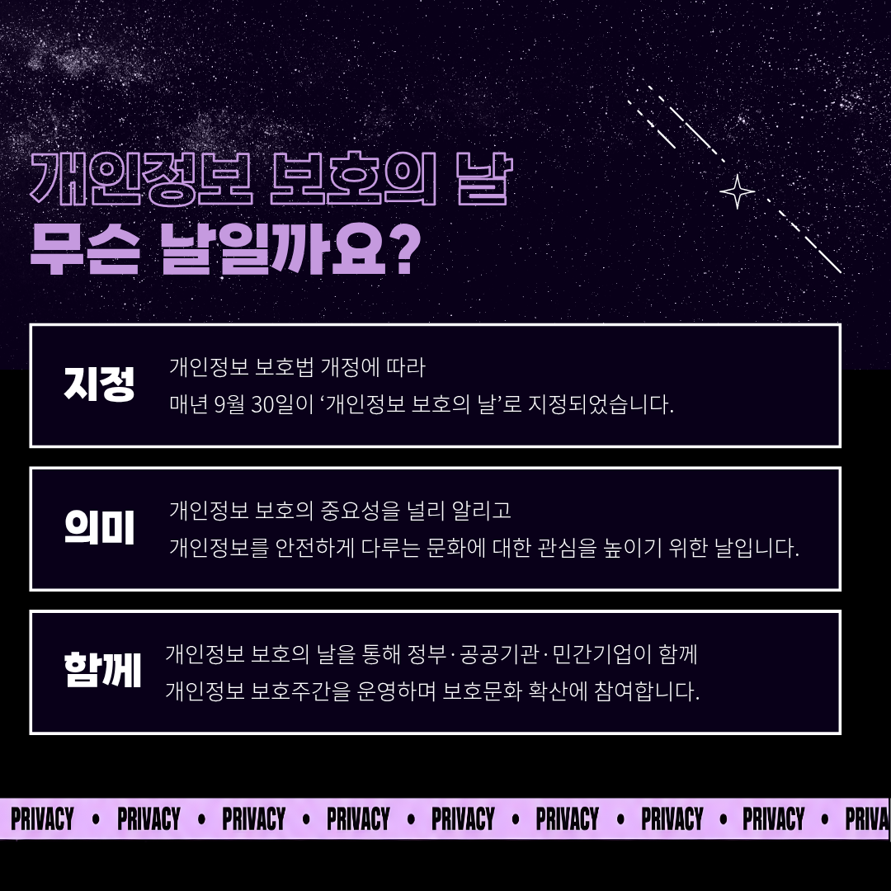

# BLACK SWAN ROULETTE

  

  <a href="https://sonotri.github.io/Privacy_Campaign/" target="_blank"><strong>게임 플레이하기</strong></a>

 

## 프로젝트 소개

**BLACK SWAN ROULETTE**는 룰렛 게임을 통해 개인정보 제공과 선택의 의미를 직접 체험해보는 웹 게임입니다. 추가 기회를 얻기 위해 개인정보를 선택하고 게임이 끝난 뒤에는 자신이 제공한 정보들이 서로 연결되었을 때 어떤 새로운 단서가 만들어질 수 있는지를 확인합니다.

이를 통해 개인정보를 단순히 ‘중요한 정보’와 ‘중요하지 않은 정보’로 나누는 것이 아닌 정보의 가치가 사용 목적과 맥락 그리고 다른 정보와의 결합에 따라 달라질 수 있음을 직접 확인할 수 있도록 구성하였습니다.

 

## 게임 플레이

- [게임 플레이하기](https://sonotri.github.io/Privacy_Campaign/)
- 시작 화면에서 게임을 시작한 뒤 룰렛을 돌립니다.
- 처음에는 무료 SPIN 1회를 받으며 세 심볼이 모두 같으면 JACKPOT(당첨)입니다.
- 기회를 모두 사용하면 개인정보 카드 한 장을 선택하고 내용을 직접 작성해 추가 SPIN과 교환합니다.

 

## 주요 개인정보 시나리오

개인정보 카드는 일상에서 쉽게 제공할 수 있는 정보와 연락·생활 영역의 정보를 함께 다룹니다.

- 닉네임과 관심사
- 생년월일과 학교/소속
- 이메일 주소와 거주지 정보

게임이 끝난 뒤에는 자신이 선택한 정보들을 다시 살펴보며 각각의 정보가 서로 연결되었을 때 어떤 새로운 단서가 만들어질 수 있는지 확인합니다. 또한 이러한 정보만으로 어디까지 추정할 수 있는지 그리고 그 추정에는 어떤 한계가 있는지도 함께 살펴봅니다.

 

## 제작

<table align="center">
  <tr>
    <td align="center" width="220" style="background-color: #ffffff;">
      <a href="https://github.com/sonotri">
         
        <strong>sonotri</strong>
      </a> 
      Planning · Design · Development · Operate
    </td>
    <td align="center" width="220" style="background-color: #f3f4f6;">
      <a href="https://github.com/yebbis">
         
        <strong>yebbis</strong>
      </a> 
      Planning · Design · Development · Operate
    </td>
    <td align="center" width="220" style="background-color: #ffffff;">
      <a href="https://github.com/EunjuYi">
         
        <strong>EunjuYi</strong>
      </a> 
      Design · Development · Operate
    </td>
    <td align="center" width="220" style="background-color: #f3f4f6;">
      <a href="https://github.com/umini1002">
         
        <strong>umini1002</strong>
      </a> 
      Design · Development · Operate
    </td>
